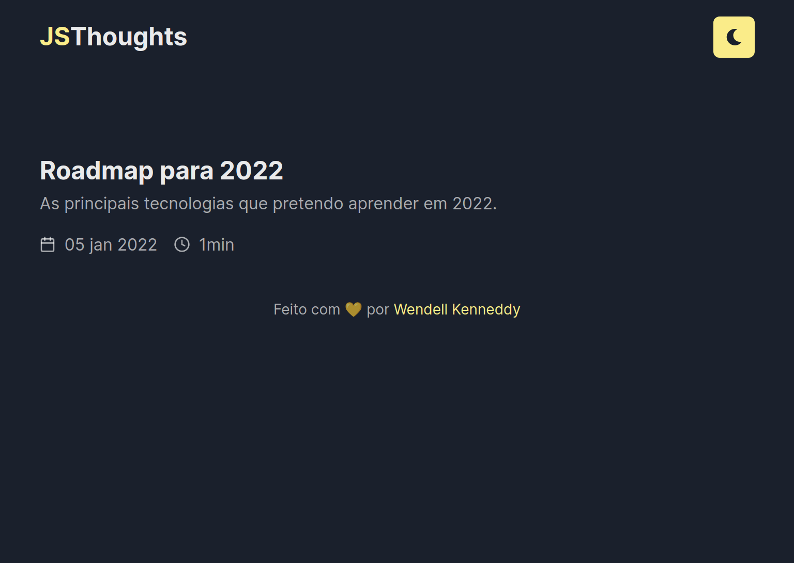

# JSThoughts

---

## 📕 About

JSThoughts is my personal blog about Javascript related things.

---

## ⚒️ Used Technologies

To develop this app, I used these technologies:

- NextJS (Create Next App)
- Typescript
- ChakraUI
- Prismic as CMS
- Jest for testing

---

## ✨ Features

- NextJS Incremental Static Regeneration
- Responsivity
- Dark and light themes
- Caching with React Query

---

## ⚙️ How to Use

First, clone the repository.

Inside the project folder, run `yarn` or `yarn install` to install the dependencies.

Populate your `.env.development.local` with your environment variables. Check the `.env.example` for more info.

Then, run `yarn dev` to start a local development server.

---

## 🤝 Be a Contributor

Have any idea that can help boost the project, and want to share it? It's simple!

1. Clone the project
2. Modify what you want
3. Commit the changes
4. Open a Pull Request

---

## 🔓 License

This project is under license. Click [here](./LICENSE.md) for details.
